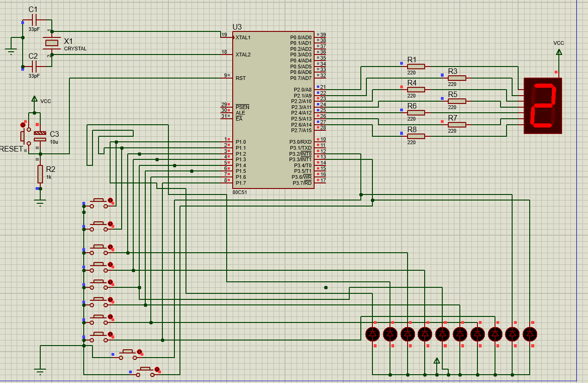
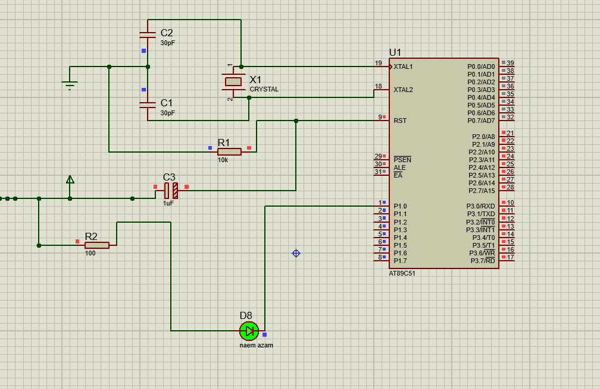
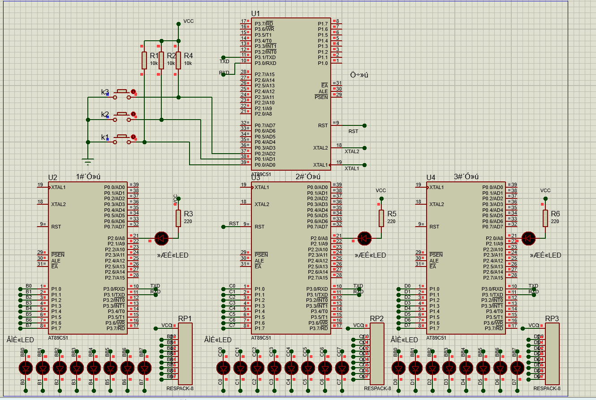
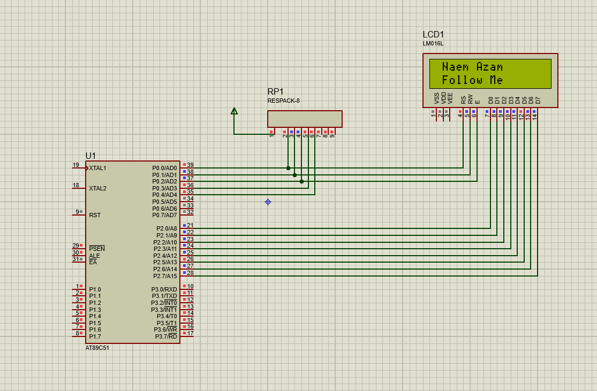

# microprocessor-design-with-Proteus-and-keil

A microprocessor is a computer processor wherein the data processing logic and control is included on a single integrated circuit, or a small number of integrated circuits. The microprocessor contains the arithmetic, logic, and control circuitry required to perform the functions of a computer's central processing unit.

## Software
<table>
  <tr>
    <td></img> </td>
     <td></img>  </td>
     </tr>
  </table>
  
  ## Lab list 
  <table>
  <tr>
     <th> Lab name </th>
    <th> Semulation picture Picture </th>
   <th> Youtube Video </th>
  </tr>
     <tr>
     <td>  Led blink using microcontroller </td>
     <td></img>  </td>
     <td><a href="https://youtu.be/Dnk83pcP2no"> Tutorial </td>
     </tr>
      <tr>
     <td> One Led blink in circuler manner on 1s delay using microcontroller </td>
     <td></img>  </td>
      <td><a href="https://youtu.be/DreXOVcRsec"> Tutorial </td>
     </tr>
     <tr>
     <td> 4 multiplex Seven Segment Display With same output </td>
     <td></img>  </td>
      <td><a href="https://youtu.be/6ktwKmjAvAk"> Tutorial </td>
     </tr>
     <tr>
     <td> use one 7-seg display to show the pressed key 
number</td>
     <td></img>  </td>
      <td><a href="#"> Tutorial </td>
     </tr>
     <tr>
     <td>use one 7-seg display  to show the pressed key
number (0 to F) with 4*4 matrix display </td>
     <td></img>  </td>
      <td><a href="https://youtu.be/7w-lL5B9Ti4"> Tutorial </td>
     </tr>
     <tr>
     <td>control LED to be on and off with 1s interval with timer </td>
     <td></img>  </td>
      <td><a href=""> Tutorial </td>
     </tr>
     <tr>
     <td>Master-Slave Serial Communication</td>
     <td></img>  </td>
      <td><a href="https://www.youtube.com/watch?v=55szTXuL-1E"> Tutorial </td>
     </tr>
     <tr>
     <td>scoriling Text on Display</td>
     <td></img>  </td>
      <td><a href="https://www.youtube.com/watch?v=qBEllj1PeKM"> Tutorial </td>
     </tr>
     
  </table>
